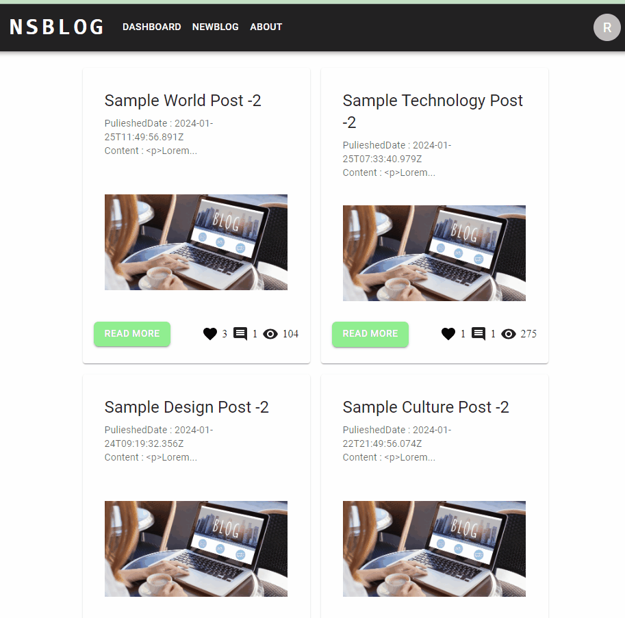
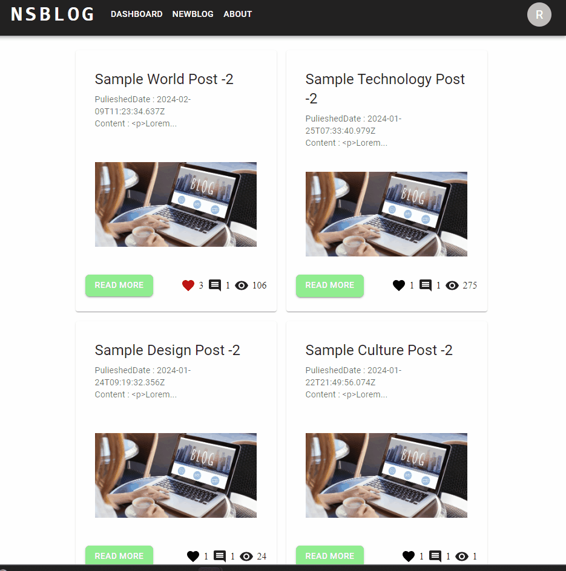
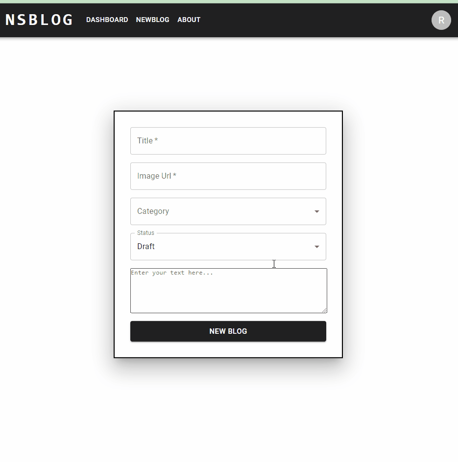
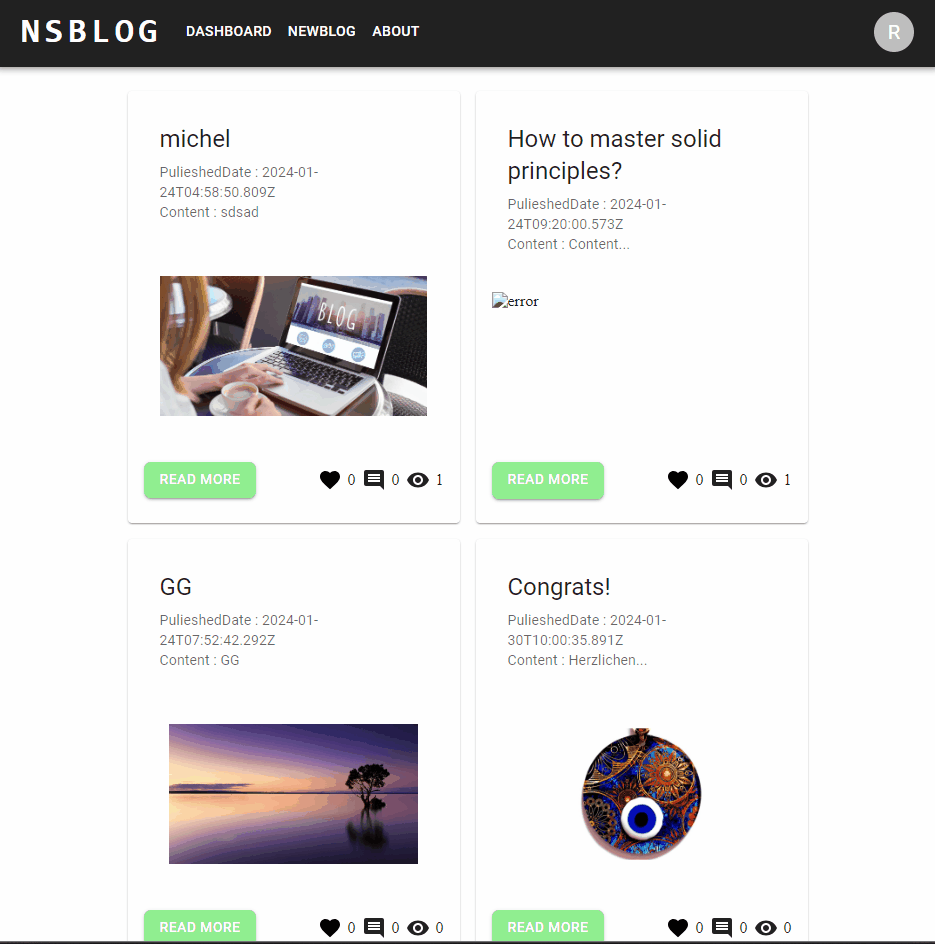
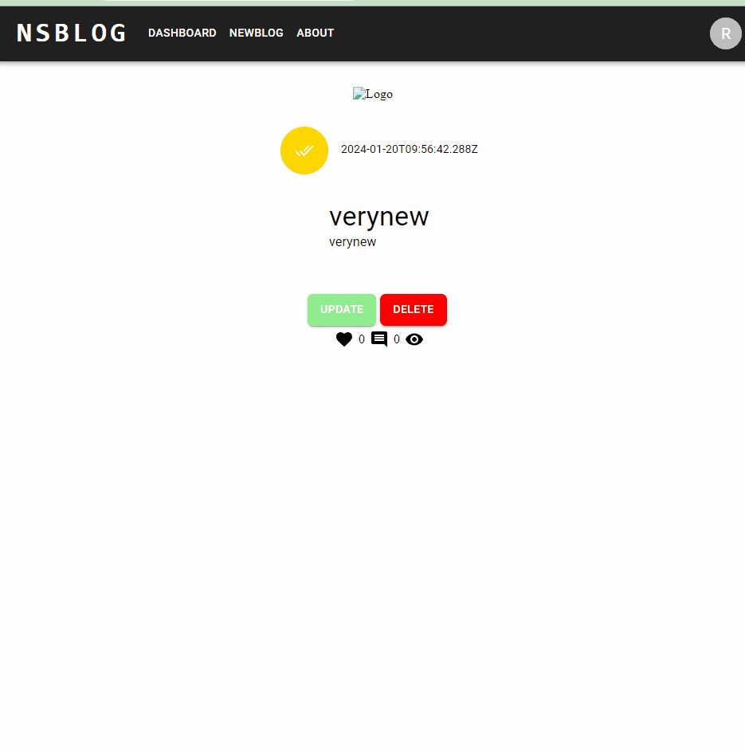

# Blog App

https://ns-blogapp.netlify.app/

### Following topics are  covered;

- HTML, CSS, JS, ReactJS, Redux, MUI

### IN THIS PROJECT :

-In this project, the user can read the blogs written by other users without registering. If he wants to access other features of the site, the site redirects him to the login page, if he is not a member, it redirects him to the register page.

-After registering, the user can comment, like and write blogs on these blogs.
-With MyBlogs option, they can access their own blogs, update or delete them.
-Read More button to access the full page of the blog.

## Postman Documentation

[View Postman Documentation](https://documenter.getpostman.com/view/19994125/2s9YsGhYRx)
